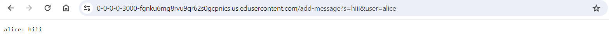
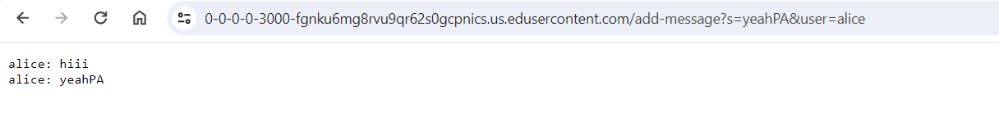
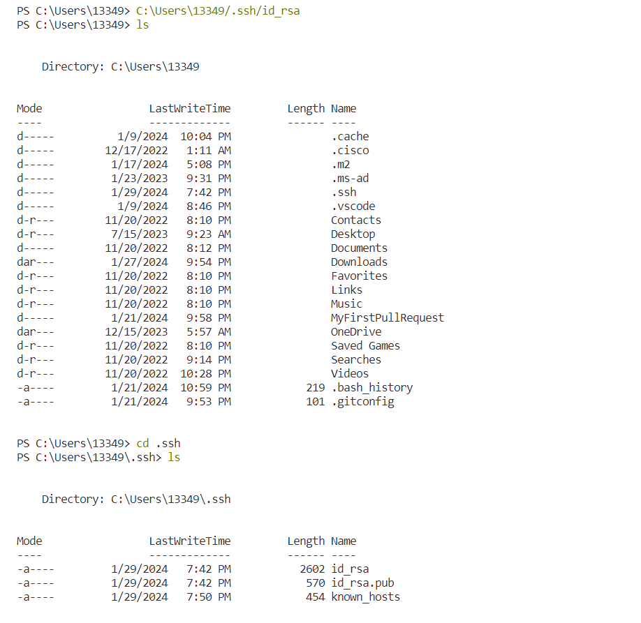
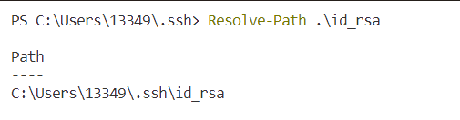
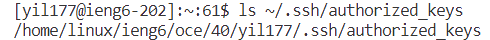
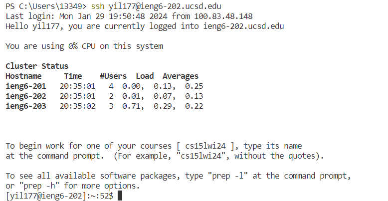

Hihihihih low battery warning with my computer!

```java
import java.io.IOException;
import java.net.URI;

class Handler implements URLHandler {
    private static String messages = "";
    public String handleRequest(URI url){
        if(url.getPath().equals("/add-message")){
            String[] whole = url.getQuery().split("&");
            String[] sentencepart = whole[0].split("=");
            String[] userpart = whole[1].split("=");
            String user = userpart[1];
            String sentence = sentencepart[1];
            String message = user + ": " + sentence + "\n";
            messages += message;
            return messages;
        }
        return "404 Not Found!";
    }
}

class ChatServer {
    public static void main(String[] args) throws IOException {
        if(args.length == 0){
            System.out.println("Missing port number! Try any number between 1024 to 49151");
            return;
        }

        int port = Integer.parseInt(args[0]);

        Server.start(port, new Handler());
    }
}
```

## `/add-message` screenshot

1. When running the command java ChatServer 3000 and send the request /add-message?s=hiii&user=alice, the following methods are called:
main(String[] args) in the ChatServer class.  
Server.start(int port, URLHandler handler) method in Server class.
handleRequest(URI url) in the Handler class.  

2. In the main method, the args array contains one element: args[0] which is the string "3000". The port variable in the ChatServer class would be set to the integer 3000 after parsing the args[0].     
In the Server.start method, the port argument would be 3000, and the handler argument would be a new instance of Handler.     
In the handleRequest method of the Handler class, the url parameter would be a URI object representing the request URI: /add-message?s=hiii&user=alice.
The messages field in the Handler class starts as an empty String.

3. The messages field in the Handler class would change from an empty String to "alice: hiii\n". This change occurs because the handleRequest method appends the user and the message to the messages field, along with a newline character.
   

1. handleRequest(URI url) method in the Handler class.  
2. The url parameter to handleRequest(URI url) method would be a URI object representing the modified request URI: /add-message?s=yeahpa&user=alice.
The messages field of the Handler class would be "alice: hiii\n" from the previous state before this request.
3. The messages field in the Handler class would change by appending the new message. After the method call with the new request, the field messages would have a new value, which is the previous messages plus the new one, resulting in "alice: hiii\nalice: yeahpa\n"


## Part2a



## Part2b


## Part2c



## Part3
I learned how to set up SSH keys for easy access and the simplified working process behind them. I also learned how I can navigate myself to the location of these keys.


   


