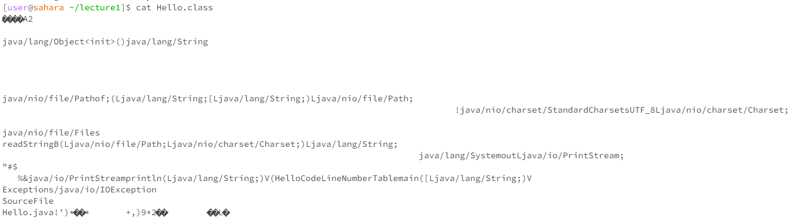

Hihihihih low battery warning with my computer!

```java
import java.io.IOException;
import java.net.URI;

class Handler implements URLHandler {
    private static String messages = "";
    public String handleRequest(URI url){
        if(url.getPath().equals("/add-message")){
            String[] whole = url.getQuery().split("&");
            String[] sentencepart = whole[0].split("=");
            String[] userpart = whole[1].split("=");
            String user = userpart[1];
            String sentence = sentencepart[1];
            String message = user + ": " + sentence + "\n";
            messages += message;
            return messages;
        }
        return "404 Not Found!";
    }
}

class ChatServer {
    public static void main(String[] args) throws IOException {
        if(args.length == 0){
            System.out.println("Missing port number! Try any number between 1024 to 49151");
            return;
        }

        int port = Integer.parseInt(args[0]);

        Server.start(port, new Handler());
    }
}


## `cat` command with a path to a file as an argument

The working directory is still lecture1;
It displays the contents of files. Therefore it displays `Hello.class` in details as output;
The output is not an error.


