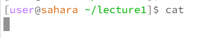

Hihihihih low battery warning with my computer!

## `cd` command with no arguments

the working directory is now the home page;
We were in the lecture1 directory. Running the `cd` command with no arguments simply meant returning to the home page. Therefore we are back to the home page;
There is no output. The output is not an error.

## `cd` command with a path to a directory as an argument

the working directory is now lecture1;
We were in the home page. Running the `cd` command with the argument lecture1 means that we now switch to the directory lecture1;
There is no output, the only thing different is that we now work with the lecture1 directory. Therefore the output is not an error.

## `cd` command with a path to a file as an argument

the working directory is still lecture1;
The `cd` command stands for changing the directory, therefore it expects a directory name instead of a file name as the argument;
The output is an error message, as the `en-us.txt` it's not a directory, hence the "No such file or directory" message.

## `ls` command with no arguments

The working directory is still lecture1;
The `ls` command is used to list all the files and directories in the current working space. Therefore the output shows the `Hello.class, Hello.java, and README` file and the `messages` directory;
The output is not an error;

## `ls` command with a path to a directory as an argument

The working directory is still lecture1;
Since we clarified to list out files under the messages directory, the `ls` command lists out files under this subdirectory, therefore this output;
The output is not an error;

## `ls` command with a path to a file as an argument

The working directory is still lecture1;
When we pass a filename to `ls`, it will simply list the name of the file if it exists in the current directory. Therefore we got the output `Hello.class`;
The output is not an error.

## `cat` command with no arguments

The working directory is still lecture1;
The command `cat` is used to display the contents of files to the terminal. When running `cat` without arguments and do not enter any input, we will not see any output because `cat` is waiting for input to display. Therefore there is a blank for output here. 
The output is not an error.

## `cat` command with a path to a directory as an argument

The working directory is still lecture1;
The command `cat` is used to display the contents of files, and it does not work with directories. The output indicates that the `cat` command was used with the argument `messages`, which is a directory, not a file;
The output is an error, since `messages` is not a file but a directory.

## `cat` command with a path to a file as an argument

The working directory is still lecture1;
It displays the contents of files. Therefore it displays `Hello.class` in details as output;
The output is not an error.

