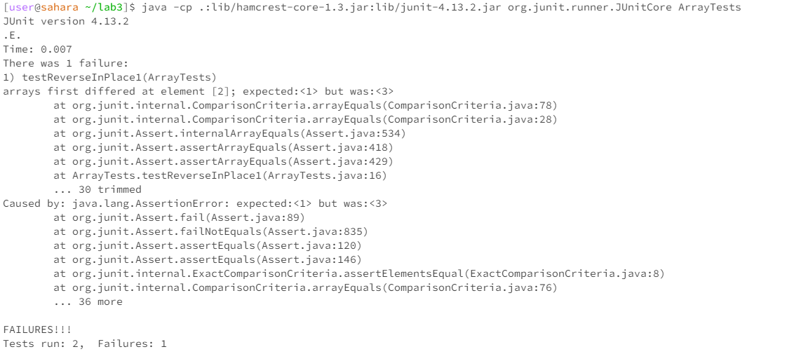

## Part 1

**failed test case**
```
@Test 
	public void testReverseInPlace1() {
    int[] input1 = { 1, 2, 3 };
    ArrayExamples.reverseInPlace(input1);
    assertArrayEquals(new int[]{ 3, 2, 1 }, input1);
	}
```

**passed test case**
```
@Test 
	public void testReverseInPlace() {
    int[] input1 = { 3 };
    ArrayExamples.reverseInPlace(input1);
    assertArrayEquals(new int[]{ 3 }, input1);
	}
```
**symptom**


**before & after**
```
static void reverseInPlace(int[] arr) {
    for(int i = 0; i < arr.length; i += 1) {
      arr[i] = arr[arr.length - i - 1];
    }
  }
```
```
static void reverseInPlace(int[] arr) {
   for(int i = 0; i < arr.length / 2; i++) {
    int temp = arr[i];
    arr[i] = arr[arr.length - i - 1];
    arr[arr.length - i - 1] = temp;
    }
  }
```
The original version attempts to swap elements, but as it goes through the entire array, it ends up swapping the elements back to their original places. To fix this, we only loop through half of the array and swap the elements at the ith index with those at the `arr. length - i - 1` index.


## Part 2 - grep
#1a
```
grep -r "terrorism" ./technical/911report/*.txt
```
It searches for the pattern "terrorism" in all .txt files under the technical/911report directory, including its subdirectories.
the following are a few heads of the output:
```
[user@sahara ~/docsearch]$ grep -r "terrorism" ./technical/911report/*.txt
./technical/911report/chapter-10.txt:            In response to a request about the counterterrorism benefits of the 9/11 detainee
./technical/911report/chapter-10.txt:                links to terrorism departed on these flights.
./technical/911report/chapter-10.txt:                terrorism as a threat to our way of life," an aim that would include pursuing other
./technical/911report/chapter-10.txt:                agreed to every U.S. request for support in the war on terrorism. The next day, the
./technical/911report/chapter-10.txt:                its resources to eliminate terrorism as a threat, punish those responsible for the
./technical/911report/chapter-10.txt:                assign tasks for the first wave of the war against terrorism. It starts today."
./technical/911report/chapter-10.txt:                terrorism, not just on al Qaeda. It also incorporated the President's determination
./technical/911report/chapter-10.txt:                goal was the "elimination of terrorism as a threat to our way of life."
./technical/911report/chapter-10.txt:                striking Iraq during "this round" of the war on terrorism.
./technical/911report/chapter-10.txt:                for the war on terrorism specified three priority targets for initial action: al
./technical/911report/chapter-10.txt:                strategic threat to the United States. Iraq's long-standing involvement in terrorism
./technical/911report/chapter-10.txt:                the war on terrorism.
```
source: https://linuxize.com/post/how-to-use-grep-command-to-search-files-in-linux/#count-matches

#1b
```
grep -r "airline security" ./technical/
```
It searches for the string "airline security" recursively in all files within the technical directory. It helps to search for
files where specific strings appear.
```
[user@sahara ~/docsearch]$ grep -r "airline security" ./technical/
./technical/911report/chapter-11.txt:                airport and airline security procedures.
./technical/911report/chapter-13.3.txt:            111. For neglect of airline security, see Commission analysis of the Congressional
```
source: https://linuxize.com/post/how-to-use-grep-command-to-search-files-in-linux/#count-matches

#2a
```
grep -v "flight" ./technical/911report/chapter-1.txt
```
It lists lines that do not contain the word "flight" in the chapter-1.txt file.
The following are a few heads of the output:
```
[user@sahara ~/docsearch]$ grep -v "flight" ./technical/911report/chapter-1.txt


"WE HAVE SOME PLANES"

    Tuesday, September 11, 2001, dawned temperate and nearly cloudless in the eastern United States. Millions of men and women readied themselves for work. Some made their way to the Tw
in Towers, the signature structures of the World Trade Center complex in New York City. Others went to Arlington, Virginia, to the Pentagon. Across the Potomac River, the United States 
Congress was back in session. At the other end of Pennsylvania Avenue, people began to line up for a White House tour. In Sarasota, Florida, President George W. Bush went for an early m
orning run.

    For those heading to an airport, weather conditions could not have been better for a safe and pleasant journey. Among the travelers were Mohamed Atta and Abdul Aziz al Omari, who ar
rived at the airport in Portland, Maine.

INSIDE THE FOUR FLIGHTS

Boarding the Flights
```
source: https://linuxize.com/post/how-to-use-grep-command-to-search-files-in-linux/#count-matches

#2b
```
grep -v "hijack" ./technical/911report/*.txt
```
It displays all lines that do not have the word "hijack" across all .txt files in the technical/911report directory.
The following are a few last lines of the output:
```
./technical/911report/preface.txt:                enormous sympathy for the victims and their loved ones, and with enhanced respect
./technical/911report/preface.txt:                for the American people. We recognize the formidable challenges that lie ahead.
./technical/911report/preface.txt:            We also approach the task of recommendations with humility. We have made a limited
./technical/911report/preface.txt:                number of them. We decided consciously to focus on recommendations we believe to be
./technical/911report/preface.txt:                most important, whose implementation can make the greatest difference. We came into
./technical/911report/preface.txt:                this process with strong opinions about what would work. All of us have had to
./technical/911report/preface.txt:                pause, reflect, and sometimes change our minds as we studied these problems and
./technical/911report/preface.txt:                considered the views of others. We hope our report will encourage our fellow
./technical/911report/preface.txt:                citizens to study, reflect-and act.
./technical/911report/preface.txt:            Thomas H. Kean, chair
./technical/911report/preface.txt:            Lee H. Hamilton, vice chair
./technical/911report/preface.txt:        
./technical/911report/preface.txt:
```
source: https://linuxize.com/post/how-to-use-grep-command-to-search-files-in-linux/#count-matches

#3a
```
grep -l "emergency" ./technical/911report/*.txt
```
It finds and list the names of .txt files that contain the word "emergency" under the technical/911report directory.
```
[user@sahara ~/docsearch]$ grep -l "emergency" ./technical/911report/*.txt
./technical/911report/chapter-10.txt
./technical/911report/chapter-12.txt
./technical/911report/chapter-13.2.txt
./technical/911report/chapter-13.3.txt
./technical/911report/chapter-13.4.txt
./technical/911report/chapter-13.5.txt
./technical/911report/chapter-1.txt
./technical/911report/chapter-3.txt
./technical/911report/chapter-6.txt
./technical/911report/chapter-8.txt
./technical/911report/chapter-9.txt
```
source: https://linuxize.com/post/how-to-use-grep-command-to-search-files-in-linux/#count-matches

#3b
```
grep -l "response" ./technical/911report/chapter-1{0..2}.txt
```
It displays only the names of files that contain the string "response" in chapters 10 to 12.
```
[user@sahara ~/docsearch]$ grep -l "response" ./technical/911report/chapter-1{0..2}.txt
./technical/911report/chapter-10.txt
./technical/911report/chapter-11.txt
./technical/911report/chapter-12.txt
```
source: https://linuxize.com/post/how-to-use-grep-command-to-search-files-in-linux/#count-matches

#4a
```
grep -c "firefighters" ./technical/911report/chapter-5.txt
```
It counts the number of lines that mention "firefighters" in chapter-5.txt:
```
[user@sahara ~/docsearch]$ grep -c "firefighters" ./technical/911report/chapter-5.txt
0
```
source: https://linuxize.com/post/how-to-use-grep-command-to-search-files-in-linux/#count-matches

#4b
```
grep -c "World Trade Center" ./technical/911report/chapter-*.txt
```
It counts how many lines contain the phrase "World Trade Center" in all chapters of the report
```
[user@sahara ~/docsearch]$ grep -c "World Trade Center" ./technical/911report/chapter-*.txt
./technical/911report/chapter-10.txt:1
./technical/911report/chapter-11.txt:1
./technical/911report/chapter-12.txt:3
./technical/911report/chapter-13.1.txt:0
./technical/911report/chapter-13.2.txt:2
./technical/911report/chapter-13.3.txt:5
./technical/911report/chapter-13.4.txt:3
./technical/911report/chapter-13.5.txt:14
./technical/911report/chapter-1.txt:24
./technical/911report/chapter-2.txt:1
./technical/911report/chapter-3.txt:8
./technical/911report/chapter-5.txt:9
./technical/911report/chapter-6.txt:0
./technical/911report/chapter-7.txt:5
./technical/911report/chapter-8.txt:2
./technical/911report/chapter-9.txt:16
```
source: https://linuxize.com/post/how-to-use-grep-command-to-search-files-in-linux/#count-matches
