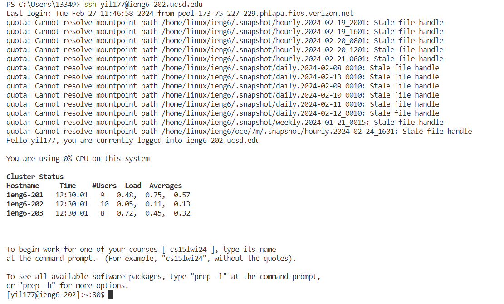
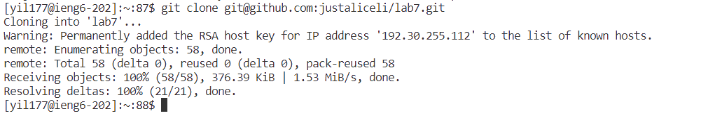
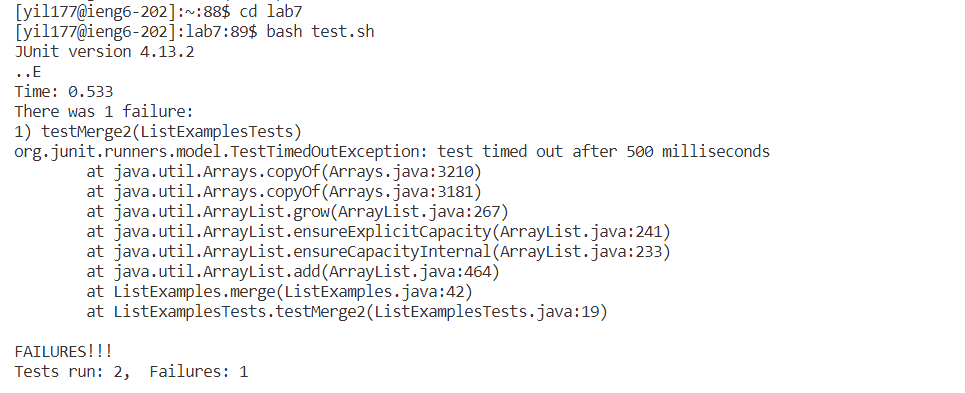
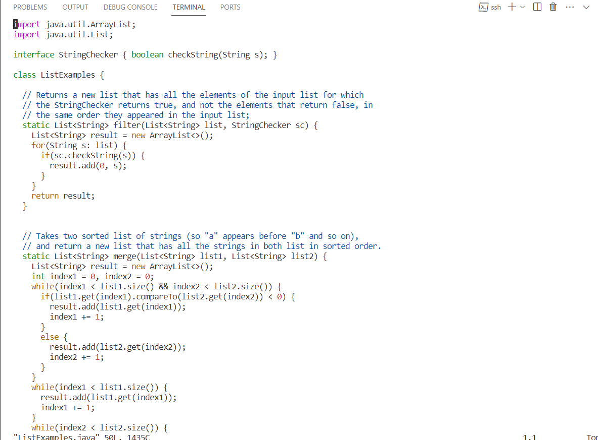
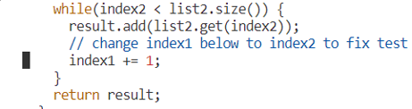
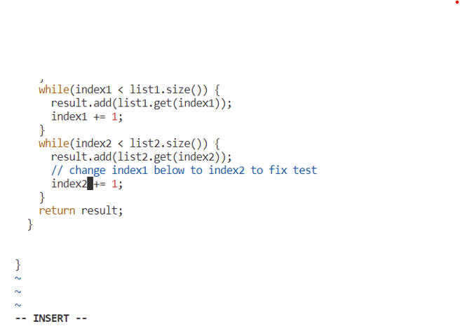
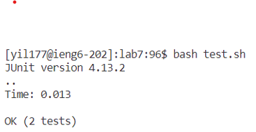
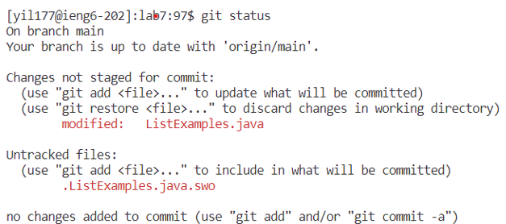
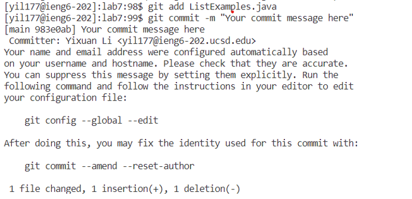
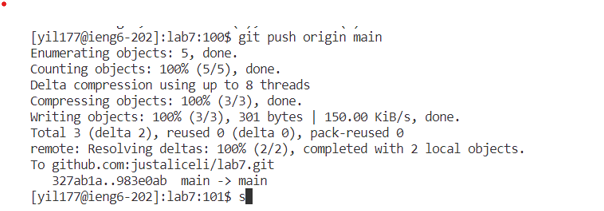

## Step 4

**key pressed:** `ssh yil177@ieng6-202.ucsd.edu`
This command helped me to log into my ieng machine

## Step 5

**key pressed:** `git clone git@github.com:justaliceli/lab7.git`
After establishing the key on github, this command allows me to clone the repository I forked using ssh URL.

## Step 6
  
**key pressed:** First `cd lab7`, Then `bash test.sh`
cd lab7 helped me to cd to the lab7 directory, which I will work on later;
bash test.sh helped me to run the test.sh file (i.e. run the test).

## Step 7
  
**key pressed:** `vim ListExamples.java`
This command allows me to open the ListExamples file and edit it.
  
**key pressed:** <j> continuously until the cursor reaches the line in the picture above; 
Then press <l> 11 times till it reaches 1 for index1;  
Press <x>, which allows me to delete that 1 in index1; 
Press <i>, enter the insert mode. 
Press <2>, add the number2 after `index`, modified `index1` to `index2`. 
 
Press <esc> to exit the insert mode; 
Press <wq> to save and exit the file; 

## Step 8
 
**key pressed:** `bash test.sh` to run the test again. It now runs successfully.

## Step 9
 
**key pressed:** `git status` to check the current status of our modified file. It is still unstaged. 
 
**key pressed:** `git add` to add the changed files to the staging area; 
`git commit` to commit the changes with a commit message; 
 
**key pressed:** `git push origin main` to push the commit to GitHub

