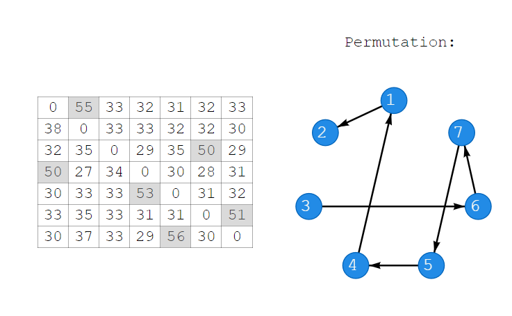
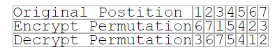

## Problem 1a
The permutation is 14253

## Problem 2a

## Problem 2b

The permutation is 6715423

## Problem 2c
In your hands, my fellow citizens, more than in mine, will rest the final success or failure of our course. Since this country was founded, each generation of Americans has been summoned to give testimony to its national loyalty. The graves of young Americans who answered the call to service surround the globe. Now the trumpet summons us again, not as a call to bear arms, though arms we need not as a call to battle, though embattled we are but a call to bear the burden of a long twilight struggle, year in and year out, rejoicing in hope, patient in tribulation as a struggle against the common enemies of man tyranny, poverty, disease, and war itself. In the long history of the world, only a few generations have been granted the role of defending freedom in its hour of maximum danger. I do not shrink from this responsibility I welcome it. I do not believe that any of us would exchange places with any other people or any other generation. The energy, the faith, the devotion which we bring to this endeavor will light our country and all who serve it, and the glow from that fire can truly light the world. And so, my fellow Americans, ask not what your country can do for you ask what you can do for your country. My fellow citizens of the world, ask not what America will do for you, but what together we can do for the freedom of man. Finally, whether you are citizens of America or citizens of the world, ask of us the same high standards of strength and sacrifice which we ask of you. With a good conscience, our only sure reward, with history the final judge of our deeds, let us go forth to lead the land we love, asking His blessing and His help, but knowing that here on earth, God's work must truly be our own

## Problem 3a
I choose `sustbjcs` to replace EVERYONE. Its chi-square statistic is 9.598.

## Problem 3b
I choose `fsmcvp` to replace BEINGS. Its chi-square statistic is 14.562.

## Problem 3c
All human beings are born free and equal in dignity and rights. They are endowed with reason and conscience and should act towards one another in a spirit of brotherhood. Everyone is entitled to all the rights and freedoms set forth in this declaration, without distinction of any kind, such as race, colour, sex, language, religion, political or other opinion, national or social origin, property, birth or other status. Furthermore, no distinction shall be made on the basis of the political, jurisdictional or international status of the country or territory to which a person belongs, whether it be independent, trust, non-self-governing or under any other limitation of sovereignty. Everyone has the right to life, liberty and the security of person. No one shall be held in slavery or servitude; slavery and the slave trade shall be prohibited in all their forms. No one shall be subjected to torture or to cruel, inhuman or degrading treatment or punishment. Everyone has the right to recognition everywhere as a person before the law. All are equal before the law and are entitled without any discrimination to equal protection of the law. All are entitled to equal protection against any discrimination in violation of this declaration and against any incitement to such discrimination.

## Problem 4a
The keyword is `CHURCHILL`

## Problem 4b
The United States stands at this time at the pinnacle of world power. It is a solemn moment for the American democracy. With primacy in power is also joined an awe-inspiring accountability to the future. As you look around you, you must feel not only the sense of duty done but also feel anxiety lest you fall below the level of achievement. Opportunity is here now, clear and shining for both our countries. To reject it or ignore it or fritter it away will bring upon us all the long reproaches of the after time. It is necessary that constancy of mind, persistency of purpose, and the grand simplicity of decision shall guide and rule the conduct of the English-speaking peoples in peace as they did in war. We must, and I believe we shall, prove ourselves equal to this severe requirement. A shadow has fallen upon the scenes so lately lighted by the Allied victory. Nobody knows what Soviet Russia and its Communist international organization intends to do in the immediate future, or what are the limits of any expansive and proselytizing tendencies. I have a strong admiration and regard for the valiant Russian people and for my wartime comrade, Marshal Stalin. There is sympathy and goodwill in Britain and I doubt not here also towards the peoples of all the Russias and a resolve to preserve through many differences and rebuffs, in establishing lasting friendships. We understand the Russian need to be secure on her western frontiers by the removal of all possibility of German aggression. We welcome Russia to her rightful place among the leading nations of the world. Above all, we welcome constant, frequent, and growing contacts between the Russian people and our own people on both sides of the Atlantic. It is my duty, however, for I am sure you would wish me to state the facts as I see them to you, to place before you certain facts about the present position in Europe. From Stettin in the Baltic to Trieste in the Adriatic, an iron curtain has descended across the Continent. Behind that line lie all the capitals of the ancient states of Central and Eastern Europe. Warsaw, Berlin, Prague, Vienna, Budapest, Belgrade, Bucharest, and Sofia, all these famous cities and the populations around them lie in what I must call the Soviet sphere, and all are subject, in one form or another, not only to Soviet influence but to a very high and, in some cases, increasing measure of control from Moscow. Athens alone, with its immortal glories, is free to decide its future at an election under British, American, and French observation. The Russian-dominated Polish Government has been encouraged to make enormous and wrongful inroads upon Germany and mass expulsions of millions of Germans on a scale grievous and undreamed of are now taking place. The Communist parties, which were very small in all these Eastern states of Europe, have been raised to pre-eminence and power far beyond their numbers and are seeking everywhere to obtain totalitarian control. Police governments are prevailing in nearly every case, and so far, excepting Czechoslovakia, there is no true democracy. Turkey and Persia are both profoundly alarmed and disturbed at the claims which are being made upon them and at the pressure being exerted by the Moscow Government. An attempt is being made by the Russians in Berlin to build up a quasi-Communist party in their zone of occupied Germany by showing special favors to groups of left-wing German leaders. At the end of the fighting last June, the American and British armies withdrew westward in accordance with an earlier agreement, to a depth of some points of miles on a front of nearly four hundred miles, to allow the Russians to occupy this vast expanse of territory which the Western Democracies had conquered. If now the Soviet Government tries, by separate action, to build up a pro-Communist Germany in their areas, this will cause new serious difficulties in the British and American zones and will give the defeated Germans the power of putting themselves up to auction between the Soviets and the Western Democracies. Whatever conclusions may be drawn from these facts and facts they are this is certainly not the liberated Europe we fought to build up. Nor is this one which contains the essentials of permanent peace. From what I have seen of our Russian friends and Allies during the war, I am convinced that there is nothing they admire so much as strength, and there is nothing for which they have less respect than for weakness, especially military weakness. For that reason, the old doctrine of a balance of power is unsound. We cannot afford, if we can help it, to work on narrow margins, offering temptations to a trial of strength. If the Western Democracies stand together in strict adherence to the principles of the United Nations Charter, their influence for furthering these principles will be immense, and no one is likely to molest them. If, however, they become divided or falter in their duty and if these all-important years are allowed to slip away, then indeed catastrophe may overwhelm us all.

